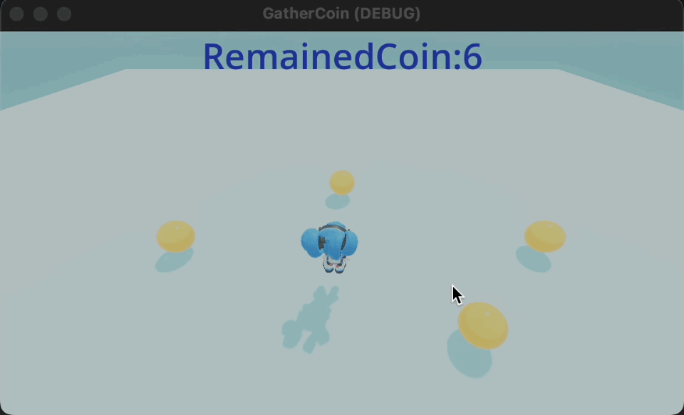

# このリポジトリについて

Godot Engineを使って3DキャラクターのSophia (Godot Engineコミュニティから公開されている3Dモデル) を操作し、６つのsphereと衝突するとスコアが変化するミニゲームを作ったリポジトリです。  

3Dモデルのインポート、衝突判定、スコアの表示方法などを確認することができます。  

# 環境構築

以下のサイトよりGodot EngineのStandard版v4.2.1をダウンロードして実行してください。  

https://godotengine.org/  

このリポジトリのproject.godotがあるフォルダでインポートを実行してください。  

# その他

グローバル変数はプロジェクト設定 > 自動読み込みの中にあるGlobalVariable.gdを使っています。  

# 参考にしたサイト、3Dモデル  

## 3Dキャラクタの配布サイト
https://github.com/gdquest-demos/godot-4-3D-Characters/tree/main  

## 3Dキャラクタのインポート、操作までの手順を紹介  

https://www.youtube.com/watch?v=r6raVUBwlDc  

## その他参考にしたサイト  

https://forum.godotengine.org/t/my-first-game-displays-grey-screen-when-playing-scene/13769/3  

https://docs.godotengine.org/en/stable/tutorials/physics/using_character_body_2d.html  

https://godotengine.org/asset-library/asset/125   

https://qiita.com/FootInGlow/items/3414d054cf0420515fba  
